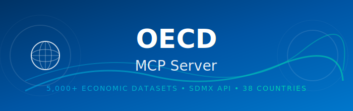

<p align="center">
  
</p>

# OECD MCP Server

[](https://oecd-mcp.onrender.com/health)
[](https://www.npmjs.com/package/oecd-mcp)
[](https://modelcontextprotocol.io/)
[](LICENSE)

En [Model Context Protocol (MCP)](https://modelcontextprotocol.io/) server som ger AI-assistenter tillgång till **OECD:s 5,000+ ekonomiska och statistiska dataset via SDMX API**. Genom att ansluta till MCP-servern kan du med hjälp av AI söka, analysera och jämföra data från 38 OECD-länder inom ekonomi, hälsa, utbildning, miljö och mer.

*A [Model Context Protocol (MCP)](https://modelcontextprotocol.io/) server providing AI assistants access to **OECD's 5,000+ economic and statistical datasets via SDMX API**. By connecting to the MCP server, you can use AI to search, analyze, and compare data from 38 OECD countries across economy, health, education, environment, and more.*

---

## Snabbstart

<details>
<summary>🇬🇧 Quick start</summary>

It's easy to connect an LLM / AI chatbot to the MCP server. Connect either directly to the hosted server (simple and convenient) or install locally. Below you'll find guides for different clients.

**1. AI Chatbots (Web)**

**ChatGPT:**
1. Open settings and enable Developer Mode
2. Create new connection with URL: `https://oecd-mcp.onrender.com/mcp`

**Claude:**
1. Go to https://claude.ai and log in
2. Click your profile (bottom left) → **Settings**
3. Go to **Developer** or **Integrations**
4. Click **Add MCP Server** or **Connect**
5. Name: `OECD`, URL: `https://oecd-mcp.onrender.com/mcp`
6. Click **Connect**

**2. Local Installation**

**Claude Desktop:**
```bash
git clone https://github.com/isakskogstad/OECD-MCP.git
cd OECD-MCP
npm install && npm run build
```
Then add to Claude Desktop config (Settings → Developer → Edit Config).

**Claude Code:**
```bash
claude mcp add --transport http oecd https://oecd-mcp.onrender.com/mcp
```

**OpenAI Codex:** Add to `~/.codex/config.toml`:
```toml
[mcp.oecd]
url = "https://oecd-mcp.onrender.com/mcp"
transport = "http"
```

</details>

Det är enkelt att ansluta en LLM / AI-chatbot till MCP-servern. Anslut antingen direkt till den hostade servern (enkelt och smidigt) eller installera lokalt. Nedan finner du guider för olika klienter.


<details>


<summary><strong>1. AI-chatbotar</strong></summary>
<details>

<summary><strong>ChatGPT (Web)</strong></summary>

---

1. Öppna inställningar och aktivera Developer Mode
2. Skapa ny anslutning med URL: `https://oecd-mcp.onrender.com/mcp`

#### Videoguide (tryck play)


</details>

<details>
<summary><strong>Claude (Web)</strong></summary>

---

**1. Gå till claude.ai:**
- Logga in på https://claude.ai

**2. Öppna inställningar:**
- Klicka på din profil (nere till vänster)
- Välj **"Settings"**

**3. Lägg till MCP-server:**
- Gå till **"Developer"** eller **"Integrations"**
- Klicka **"Add MCP Server"** eller **"Connect"**
- **Name:** `OECD`
- **URL:** `https://oecd-mcp.onrender.com/mcp`
- Klicka **"Connect"** eller **"Add"**

#### Videoguide (tryck play)
https://allgot.se/wp-content/uploads/users/1/Claude-Web-MCP-guide.mp4

---

</details>

</details>


---

<details>


<summary><strong>2. Lokal installation</strong></summary>


<details>
<summary><strong>Claude Desktop</strong></summary>


**1. Klona och bygg:**
```bash
git clone https://github.com/isakskogstad/OECD-MCP.git
cd OECD-MCP
npm install && npm run build
```

**2. I Claude Desktop:**
- Settings → **Developer** (inte Connectors!)
- Klicka **"Edit Config"**

**3. Lägg till i JSON-filen:**
```json
{
  "mcpServers": {
    "oecd": {
      "command": "node",
      "args": ["/absolut/sökväg/till/OECD-MCP/dist/index.js"]
    }
  }
}
```

**4. Spara och starta om Claude Desktop**

**Notera:** Lokal installation använder stdio-transport via Developer-sektionen, inte Connectors.

</details>

<details>
<summary><strong>Claude Code</strong></summary>


**Live-Server:**
```bash
claude mcp add --transport http oecd https://oecd-mcp.onrender.com/mcp
```

**Lokal (från källkod):**
```bash
# Efter git clone och npm install (se ovan)
claude mcp add oecd node /absolut/sökväg/till/dist/index.js
```

**Verifiera:** `claude mcp list`

</details>

<details>
<summary><strong>OpenAI Codex</strong></summary>

#### Remote Server (HTTP)

**`~/.codex/config.toml`:**
```toml
[mcp.oecd]
url = "https://oecd-mcp.onrender.com/mcp"
transport = "http"
```

#### Lokal installation

**1. Klona och bygg (om ej redan gjort):**
```bash
git clone https://github.com/isakskogstad/OECD-MCP.git
cd OECD-MCP
npm install && npm run build
```

**2. Konfigurera stdio-transport:**

**`~/.codex/config.toml`:**
```toml
[mcp.oecd]
command = "node"
args = ["/absolut/sökväg/till/OECD-MCP/dist/index.js"]
transport = "stdio"
```

**Windows:**
```toml
[mcp.oecd]
command = "node"
args = ["C:\\Users\\username\\OECD-MCP\\dist\\index.js"]
transport = "stdio"
```
</details>
</details>


---

## Funktioner

<details>
<summary>🇬🇧 Features</summary>

The server connects to the OECD SDMX API providing access to 5,000+ datasets across 17 categories:

**OECD SDMX API**
Access to quarterly national accounts (QNA), main economic indicators (MEI), health statistics, education data, environmental indicators, and more from 38 OECD member countries plus partner economies.

#### Tools
The MCP server implements the MCP protocol with support for:
- **9 tools** — Dataset discovery (5) and data access (4)
- **7 resources** — Categories, countries, filter guide, glossary, LLM instructions
- **7 prompt templates** — Economic analysis, country comparisons, Nordic focus

</details>

Servern kopplar till OECD SDMX API och ger tillgång till 5,000+ dataset inom 17 kategorier:

**OECD SDMX API**
Tillgång till kvartalsvisa nationalräkenskaper (QNA), huvudsakliga ekonomiska indikatorer (MEI), hälsostatistik, utbildningsdata, miljöindikatorer och mer från 38 OECD-medlemsländer plus partnerekonomier.

#### Verktyg (tools)
MCP-servern implementerar MCP-protokollet med stöd för:
- **9 verktyg** — Dataset-sökning (5) och dataåtkomst (4)
- **7 resurser** — Kategorier, länder, filterguide, ordlista, LLM-instruktioner
- **7 promptmallar** — Ekonomisk analys, landsjämförelser, nordiskt fokus

### Verktyg

| Verktyg | Beskrivning |
|---------|-------------|
| `search_dataflows` | Sök efter dataset med nyckelord |
| `list_dataflows` | Lista dataset per kategori |
| `get_categories` | Lista alla 17 datakategorier |
| `get_popular_datasets` | Hämta vanliga dataset |
| `search_indicators` | Sök specifika indikatorer |
| `get_data_structure` | Hämta metadata för dataset |
| `query_data` | Fråga statistiska data |
| `get_dataflow_url` | Generera OECD Data Explorer-länk |
| `list_categories_detailed` | Detaljerad kategoriinfo |

### Resurser

| Resurs | Beskrivning |
|--------|-------------|
| `oecd://categories` | 17 datakategorier med beskrivningar |
| `oecd://dataflows/popular` | Kurerade populära dataset |
| `oecd://countries` | ISO 3166-1 alpha-3 landskoder |
| `oecd://filter-guide` | SDMX filtersyntax-guide |
| `oecd://glossary` | Definitioner av OECD-termer |
| `oecd://llm-instructions` | Instruktioner för AI-assistenter |
| `oecd://api/info` | API-information |

### Promptmallar

| Prompt | Beskrivning |
|--------|-------------|
| `analyze_economic_trend` | Analysera ekonomiska trender över tid |
| `compare_countries` | Jämför data mellan länder |
| `get_latest_statistics` | Hämta senaste statistik |
| `explore_dataset` | Guidad utforskning av dataset |
| `find_data_for_question` | Hitta rätt dataset för en fråga |
| `build_filter` | Hjälp att bygga SDMX-filter |
| `nordic_comparison` | Jämför nordiska länder |


---


## Användningsområden

<details>
<summary>🇬🇧 Use cases</summary>

### Economists & Researchers

| Tool | Description |
|------|-------------|
| `query_data` | Query GDP, inflation, unemployment data |
| `search_dataflows` | Find datasets for research questions |
| `get_data_structure` | Understand dataset dimensions |

**Examples:**
- "Compare GDP growth between G7 countries 2020-2024"
- "Analyze inflation trends in the Eurozone"
- "Find data on labor productivity by sector"

---

### Policy Analysts

| Tool | Description |
|------|-------------|
| `get_categories` | Browse 17 policy areas |
| `list_dataflows` | Find relevant policy datasets |
| `get_dataflow_url` | Generate links for reports |

**Examples:**
- "What healthcare spending data is available for Sweden?"
- "Find education outcome indicators for PISA analysis"
- "Compare environmental policies across Nordic countries"

---

### Data Journalists

| Tool | Description |
|------|-------------|
| `search_indicators` | Find specific metrics |
| `get_popular_datasets` | Access commonly cited data |
| `query_data` | Get numbers for stories |

**Examples:**
- "Get latest unemployment figures for EU countries"
- "Find income inequality data (Gini coefficient)"
- "Compare tax revenues as % of GDP"

</details>


### Ekonomer & Forskare

| Verktyg | Beskrivning |
|---------|-------------|
| `query_data` | Fråga BNP, inflation, arbetslöshetsdata |
| `search_dataflows` | Hitta dataset för forskningsfrågor |
| `get_data_structure` | Förstå dataset-dimensioner |

**Exempel:**
- "Jämför BNP-tillväxt mellan G7-länder 2020-2024"
- "Analysera inflationstrender i euroområdet"
- "Hitta data om arbetsproduktivitet per sektor"

---

### Policyanalytiker

| Verktyg | Beskrivning |
|---------|-------------|
| `get_categories` | Bläddra i 17 policyområden |
| `list_dataflows` | Hitta relevanta policydataset |
| `get_dataflow_url` | Generera länkar för rapporter |

**Exempel:**
- "Vilken data finns om sjukvårdsutgifter för Sverige?"
- "Hitta utbildningsindikatorer för PISA-analys"
- "Jämför miljöpolicyer mellan nordiska länder"

---

### Datajournalister

| Verktyg | Beskrivning |
|---------|-------------|
| `search_indicators` | Hitta specifika mätvärden |
| `get_popular_datasets` | Få tillgång till ofta citerad data |
| `query_data` | Hämta siffror för artiklar |

**Exempel:**
- "Hämta senaste arbetslöshetssiffror för EU-länder"
- "Hitta data om inkomstojämlikhet (Gini-koefficient)"
- "Jämför skatteintäkter som % av BNP"

---

### Datakategorier

<details>
<summary>Visa alla 17 kategorier</summary>

| Kategori | Kod | Beskrivning | Dataset |
|----------|-----|-------------|---------|
| **Ekonomi** | ECO | BNP, tillväxt, inflation, räntor | 500+ |
| **Sysselsättning** | JOB | Arbetsmarknad, löner | 300+ |
| **Handel** | TRD | Internationell handel | 250+ |
| **Hälsa** | HEA | Sjukvård, livslängd | 200+ |
| **Utbildning** | EDU | PISA, resultat | 180+ |
| **Miljö** | ENV | Klimat, utsläpp | 150+ |
| **Innovation** | STI | FoU, patent, AI | 140+ |
| **Energi** | NRG | Produktion, förnybart | 120+ |
| **Beskattning** | TAX | Skatteintäkter, skattesatser | 100+ |
| **Finans** | FIN | Marknader, bankväsende | 95+ |
| **Offentlig sektor** | GOV | Styrning, offentlig sektor | 90+ |
| **Socialt** | SOC | Ojämlikhet, livskvalitet | 85+ |
| **Jordbruk** | AGR | Produktion, matsäkerhet | 75+ |
| **Industri** | IND | Industriproduktion | 70+ |
| **Utveckling** | DEV | Utvecklingsbistånd | 60+ |
| **Transport** | TRA | Infrastruktur, mobilitet | 50+ |
| **Regional** | REG | Subnationell data | 45+ |

</details>

---

## Övrigt

<details>
<summary>🇬🇧 About</summary>

**Created by:** [Isak Skogstad](https://www.linkedin.com/in/isak-skogstad/)

**Contact:** [isak.skogstad@me.com](mailto:isak.skogstad@me.com)

**Disclaimer:** This project is independent and not affiliated with, endorsed by, or officially connected to the OECD (Organisation for Economic Co-operation and Development).

**Terms of use:** Data is provided via OECD's open SDMX API. See [OECD Terms and Conditions](https://www.oecd.org/termsandconditions/) for usage conditions.

</details>

**Skapad av:** [Isak Skogstad](https://www.linkedin.com/in/isak-skogstad/)

**Kontakt:** [isak.skogstad@me.com](mailto:isak.skogstad@me.com)

**Fristående:** Detta projekt är fristående och är inte anslutet till, godkänt av eller officiellt kopplat till OECD (Organisation for Economic Co-operation and Development).

**Användarvillkor:** Data tillhandahålls via OECD:s öppna SDMX API. Se [OECD:s användarvillkor](https://www.oecd.org/termsandconditions/) för användningsvillkor.

---

## Resurser

- **OECD Data Portal:** https://data.oecd.org/
- **SDMX Standard:** https://sdmx.org/
- **MCP Documentation:** https://modelcontextprotocol.io/
- **npm Package:** https://www.npmjs.com/package/oecd-mcp
- **Issues:** [GitHub Issues](https://github.com/isakskogstad/OECD-MCP/issues)

---

**Byggd med** [Model Context Protocol SDK](https://github.com/modelcontextprotocol) | **Version** 4.0.0
